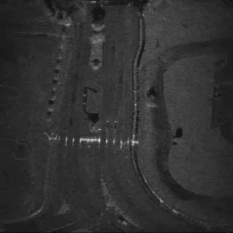

# VSDFormer

**VSDFormer: A Spatio-Temporal Restoration Framework for Video SAR Despeckling**

[Raw Video](./Videos/Noisy_Rotterdam.mp4)  [Raw Video](./Videos/Noisy_Rotterdam.mp4)  [Raw Video](./Videos/Noisy_Rotterdam.mp4)

 

## Visual Results

<table align="center" width="100%">
  <tr>
    <td align="center" width="50%">
      
       
      <b>(a) Noisy_Eubank</b>
    </td>
    <td align="center" width="50%">
      
       
      <b>(b) VSDFormer_Eubank</b>
    </td>
  </tr>

  <tr>
    <td align="center" width="50%">
      
       
      <b>(e) Noisy_Qatar</b>
    </td>
    <td align="center" width="50%">
      
       
      <b>(f) VSDFormer_Qatar</b>
    </td>
  </tr>

  <tr>
    <td align="center" width="50%">
      
       
      <b>(g) Noisy_Rotterdam</b>
    </td>
    <td align="center" width="50%">
      
       
      <b>(h) VSDForme_Rotterdam</b>
    </td>
  </tr>

  <tr>
    <td align="center" width="50%">
      
       
      <b>(c) Noisy_Australia</b>
    </td>
    <td align="center" width="50%">
      
       
      <b>(d) VSDFormer_Australia</b>
    </td>
  </tr>
  
</table>

 

> **Note:** The GIF files are compressed for visualization in the README, so the displayed quality may not fully reflect the actual restoration performance. For a more accurate comparison, please download and view the original videos.

